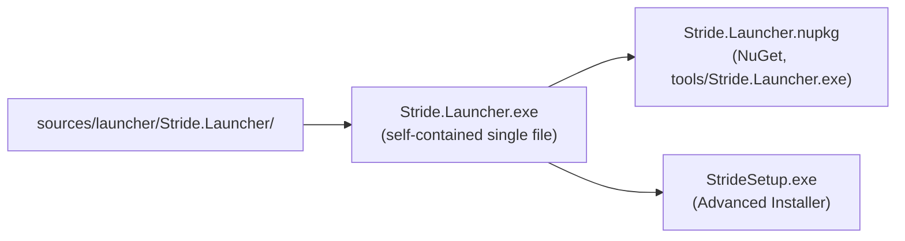

# Packaging & Distribution

The launcher ships as a NuGet package (for self-updates) and as a Windows installer (for first installs). This file describes what is produced, where it comes from, and how versions are set.

## Artifacts



| Artifact | Source | Consumed by |
|---|---|---|
| `Stride.Launcher.exe` | `dotnet publish` with [FolderProfile.pubxml](../../sources/launcher/Stride.Launcher/Properties/PublishProfiles/FolderProfile.pubxml) | `Stride.Launcher.nuspec` and `StrideSetup.exe` |
| `Stride.Launcher.nupkg` | [Stride.Launcher.nuspec](../../sources/launcher/Stride.Launcher/Stride.Launcher.nuspec), packed by `Stride.build` | `SelfUpdater`, for in-place updates |
| `StrideSetup.exe` | [Setup/setup.aip](../../sources/launcher/Setup/setup.aip) | End users (first install), and `force-reinstall:` |

The exe is self-contained and single-file: it needs no .NET install and no VC++ runtime. On first start it unpacks its content to `%TEMP%\.net\Stride.Launcher\`. Only PDBs stay outside the exe, so `tools/Stride.Launcher.exe` is the whole package.

The launcher itself has no prerequisites. The ones Game Studio needs are installed per Stride version, by `Bin\Prerequisites\install-prerequisites.exe` inside that version's package.

## Versions

The version is set in one place: the `<version>` element of [Stride.Launcher.nuspec](../../sources/launcher/Stride.Launcher/Stride.Launcher.nuspec). A pre-release adds `-p:VersionSuffix=beta1` (alpha, beta, preview or rc, numbered 1 to 9: NuGet compares `beta10` before `beta2`).

- **Launcher exe.** [Stride.Launcher.csproj](../../sources/launcher/Stride.Launcher/Stride.Launcher.csproj) reads the nuspec version and appends the suffix. `SelfUpdater` compares the exe's `AssemblyInformationalVersion` against NuGet.
- **NuGet package.** `Stride.build` (`_StrideLauncherVersion`) computes the same version and packs with `-Version`. It also fills `$ForceReinstallMinVersion$` in the description: `5.0.1` for a release, `6.0.0` for a pre-release (see [self-update.md](self-update.md#pre-releases)).
- **StrideSetup.** An MSI version is numbers only, so `GetStrideSetupVersion` maps the launcher version to `major.minor.(patch * 100 + rank)`. The rank sorts pre-releases before their release: alpha 11-19, beta 31-39, preview 51-59, rc 71-79, release 99. For example, `6.1.0-beta1` is `6.1.31` and `6.1.0` is `6.1.99`. The ProductCode is a name-based UUID of the launcher version: a new one for each version (MSI major upgrade), the same one when a version is built again. The real version (`StrideVersion` property) is what Add/Remove Programs shows.

The version values in the committed `setup.aip` are placeholders: `PackageInstaller` sets them on a copy (`setup-generated.aip`, git-ignored) and builds that.

## Stride.Launcher.nuspec

```xml
<files>
    <file src="Stride.Launcher.exe" target="tools" />
</files>
```

Everything that must land next to the exe goes under `tools/`: `SelfUpdater.UpdateLauncherFiles` hard-codes `const string directoryRoot = "tools/"` and ignores anything outside it.

The `<description>` element is special: `SelfUpdater` scans it for a `force-reinstall:` line. See [self-update.md](self-update.md#version-probe). Launchers already installed read this line; do not remove it.

## Setup/

[Setup/setup.aip](../../sources/launcher/Setup/setup.aip) builds `StrideSetup.exe`. It installs:

- `Stride.Launcher.exe`.
- A Start menu shortcut with `Launcher.ico`.
- The Add/Remove Programs entry. Uninstalling runs `Stride.Launcher.exe /uninstall` first, which uninstalls the Stride versions.

A release setup is named `StrideSetup.exe`, the name the website links. A pre-release setup is named `StrideSetup-<version>.exe` and only goes to the GitHub release.

## Building

The build is driven by [Stride.build](../../build/Stride.build) and needs Advanced Installer 22.0 for the setup:

```
msbuild build\Stride.build /t:FullBuildLauncher /p:StrideSign=false [/p:VersionSuffix=beta1]
```

`FullBuildLauncher` publishes the exe (`BuildLauncher`), packs the nupkg (`PackageLauncher`) and builds the setup (`PackageInstaller`), all into `bin\launcher\`. `_StrideSetupVersion` only prints the computed versions, without Advanced Installer.

Releases go through [release-launcher.yml](../../.github/workflows/release-launcher.yml) (manual run, optional `version-suffix`). It pushes the nupkg to NuGet.org and creates a `launcher/<version>` GitHub release with the setup; a pre-release is marked as one.

On Linux and macOS there is no installer: the launcher is run from a `dotnet publish -r linux-x64 --self-contained` output.
